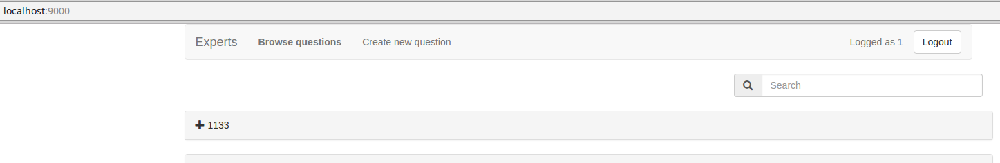
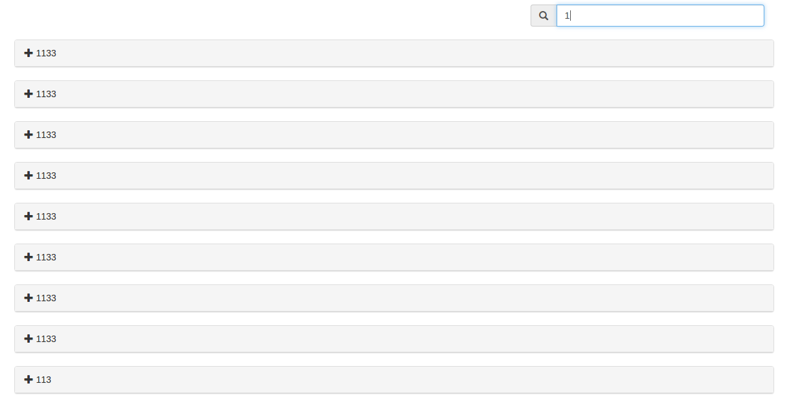
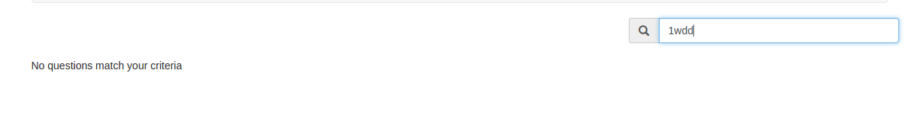
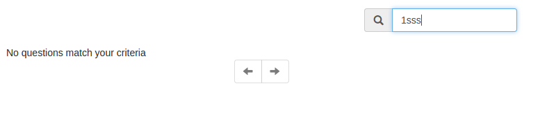
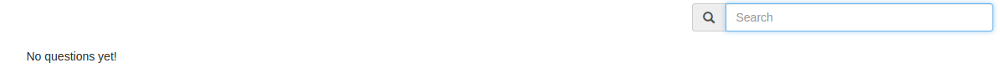
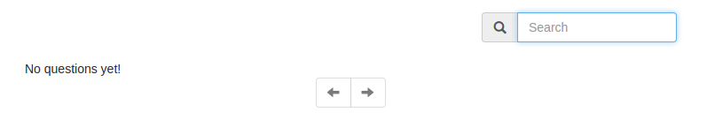
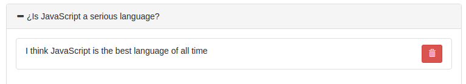
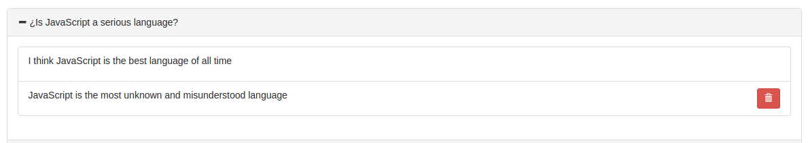
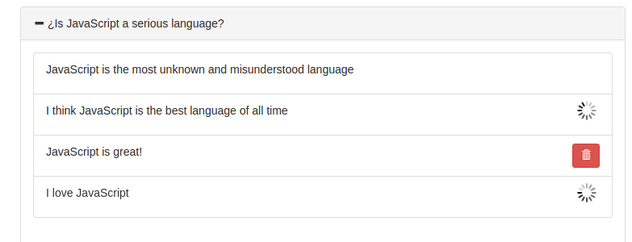
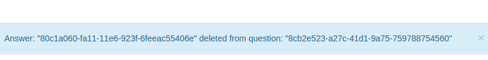

Examen Segunda Evaluación
=========================

# Día 27/02/2017 Tiempo: 5 horas

* Nota: Cada pregunta se valorará como bien o como mal (valoraciones intermedias serán excepcionales).
* Nota2: En cada pregunta se especifica si se valora en el examen de diseño o en el de desarrollo.
* Nota3: Para aprobar cada examen hay que obtener una puntuación mínima de 5 puntos en ese examen.
* Nota4: Organice su tiempo. Si no consigue resolver un apartado pase al siguiente. El examen consta ejercicios que se pueden resolver de forma independiente. Los apartados de diseño y de desarrollo también se pueden resolver por separado. Si un apartado depende de otro que no sabe resolver, siempre puede dar una solución que aunque no sea correcta, le permita seguir avanzando.
* Nota5: Para que una solución sea correcta, no sólo hay que conseguir que haga lo que se pide, sino que además todo lo que funcionaba lo tiene que seguir haciendo.
* Nota6: Lea completamente el examen antes de empezar y comience por lo que le parezca más fácil.

Pasos previos antes de empezar

* Clone el repositorio del enunciado

```bash
    git clone https://user-daw-zayas@bitbucket.org/surtich/experts-enunciado-segunda.git
```

* Vaya al directorio del repositorio

```bash
    cd experts-enunciado-segunda
```

* Configure su usuario de Git (es único para todos)

```bash
    git config user.name "user-daw-zayas"
    git config user.email "javier.perezarteaga@educa.madrid.org"
```

* Cree un *branch* con su nombre y apellidos separados con guiones (no incluya mayúsculas, acentos o caracteres no alfabéticos, excepción hecha de los guiones). Ejemplo:

```bash
    git checkout -b <fulanito-perez-gomez>
```

* Compruebe que está en la rama correcta:

```bash
    git status
```

* Suba la rama al repositorio remoto:

```bash
    git push origin <nombre-de-la-rama-dado-anteriormente>
```

* Instale las dependencias de cliente y de servidor y arranque cada aplicación (abra un terminal para cada aplicación):

**server:**

```bash
    cd server
    npm install
    npm run db:stop
    npm run db:remove # es importante asegurarse de que la base de datos está sin datos para uno de los ejercicios. No se salte este paso.
    npm run db:start
    npm start
```

**client:**

```bash
    cd client
    npm install
    npm start
```

Navegue a [http://localhost:3000](http://localhost:3000)

**aplicación de muestra**:

Abra un tercer terminal

```bash
    cd client
    npm run start-prod
```
Navegue a [http://localhost:9000](http://localhost:9000)

* Dígale al profesor que ya ha terminado para que compruebe que todo es correcto y desconecte la red.

## EXAMEN

#### 1.- Búsqueda paginada en el servidor.

#### 1.1- Cuando navegue a la raíz del proyecto se mostrará un cuadro de búsqueda como el de la imagen.



#### 1.1.1- (0,5 puntos diseño) El cuadro de búsqueda mostrará el texto "Search".
#### 1.1.2- (0,5 puntos diseño) Se mostrará un icono de una lupa junto al cuadro de búsqueda.
#### 1.1.3- (0,5 puntos diseño) El cuadro de búsqueda y el icono se mostrarán integrados (ver imagen superior).
#### 1.1.4- (0,5 puntos diseño) El cuadro de búsqueda aparecerá alineado a la derecha.
#### 1.1.5- (0,5 puntos diseño) El cuadro de búsqueda se mostrará separado de la cabecera y de la lista de preguntas (ver imagen superior).

#### 1.2- Al introducir texto en el cuadro de búsqueda únicamente se mostrarán preguntas que en su texto contengan la cadena introducida.

El filtrado de preguntas se debe hacer en el servidor utilizando el "endpoint" definido en el fichero "experts-solución-segunda/server/src/question/get.js" que se copia aquí para mayor comodidad (el parámetro que hay que utilizar para filtrar es `match`):

```javascript
app.get('/api/question', passport.authenticate('jwt', {session: false}), asyncRequest(async (req, res) => {
    const skip = parseInt(req.query.skip, 10) || 0;
    const limit = parseInt(req.query.limit, 10) || 10;
    const match = req.query.match || ''; <------------------ Query param añadido al endpoint
    const questions = await r.table('Question')
                             .pluck('id', 'text', 'creationDate', 'expirationDate', 'owner')
                             .filter(doc => doc('text').match(`(?i)${match}`))
                             .orderBy(r.desc('creationDate'))
                             .skip(skip)
                             .limit(limit);
    // send question back
    res.send(questions);
  }));
```
#### 1.2.1- (1 punto diseño) Cada vez que se modifique el contenido del cuadro de búsqueda se mostrará el "spinner" en sustitución de las preguntas.


#### 1.2.2- (1,5 puntos desarrollo) Se lanzará una petición "AJAX" contra el "endpoint" del servidor y se mostrarán las preguntas recuperadas, ocultando el "spinner".

Nota: Se penalizará no usar el spinner.



#### 1.2.3- (1 punto desarrollo) Unicamente se mostrarán las preguntas que coincidan con la búsqueda, se reemplazarán en el "store" las preguntas que hubiera con las recuperadas.
#### 1.2.4- Cada vez que se cambie el cuadro de texto se reiniciará la paginación empezando desde la primera pregunta y la paginación funcionará de la misma forma en que lo estaba haciendo
#### 1.2.4.1-(1 punto desarrollo) La paginación funcionará en pantallas grandes.
#### 1.2.4.2-(0,5 punto desarrollo) También lo hará en pantallas pequeñas.

#### 1.2.5- Al navegar a "create new question" y volver a la página principal el filtro de búsqueda debe permanecer aplicado.
#### 1.2.5.1- (1 punto diseño) El cuadro de búsqueda mantendrá el texto que hubiera introducido.
#### 1.2.5.2- (0,5 puntos desarrollo) Las preguntas se mantendrán filtradas sin necesidad de volver a buscarlas en el servidor (se mantendrá lo recuperado).

#### 1.2.6- (0,5 puntos desarrollo) No se harán búsquedas mientras se esté escribiendo en el cuadro de texto. La búsqueda se hará al pasar 500ms sin escribir. Consejo: Use el operador "debounceTime" de RxJs.

#### 1.2.7 Si no hay ninguna pregunta que corresponda con el filtro se indicará según la imagen.



#### 1.2.7.1 (0,5 puntos diseño) Funcionará lo indicado en el apartado 1.2.7 en pantallas grandes
#### 1.2.7.2 (0,5 puntos diseño) Funcionará lo indicado en el apartado 1.2.7 en pantallas pequeñas



#### 1.2.7.3 (0,5 puntos diseño) Cuando no haya ninguna pregunta en la base de datos y el cuadro de búsqueda esté vacío se mostrará lo indicado en la imagen en pantallas grandes



#### 1.2.7.4 (0,5 puntos diseño) Cuando no haya ninguna pregunta en la base de datos y el cuadro de búsqueda esté vacío se mostrará lo indicado en la imagen en pantallas pequeñas



#### 2.- Borrado de respuestas.

Las respuestas se podrán borrar por los usuarios que las crearon.

Para ello se ha modificado el esquema de las respuestas de tal forma que incluyan in "id":

```javascript
export const Question = thinky.createModel('Question', {
  text: thinky.type.string().required(),
  creationDate: thinky.type.date().default(thinky.r.now()),
  expirationDate: thinky.type.date().required(),
  answers: thinky.type.array().schema(
    thinky.type.object().schema({
      id: thinky.type.string().required(), <------------------ añadido id a las respuestas
      user: thinky.type.string().required(),
      answer: thinky.type.string().required(),
    })
  ).default([]),
  owner: thinky.type.string().required(),
});
```
El "id" de la respuesta se genera automáticamente en el servidor al guardar la respuesta ("server/src/question/answer.js"):

```javascript
...
question.answers.push({id: uuidV1(), answer, user: req.user.id}); <-------- el id se auto genera utilizando la librería uuid.
...
```

Por último, se ha añadido un "enpoint" para borrar respuestas ("server/src/question/answer.js"):

```javascript
...
app.delete('/api/question/:questionId/answer/:answerId', passport.authenticate('jwt', {session: false}), <----------- Observe método y path params
...
)
...
```

#### 2.1- Añada un botón para borrar las respuestas



#### 2.1.1.- (0,5 puntos diseño) Se mostrará un botón como el de la imagen (fíjese en tamaño y estilo).
#### 2.1.2.- (1 punto diseño) El botón estará correctamente centrado y alineado a la derecha.
#### 2.1.3.- (1 punto diseño) El botón sólo se mostrará cuando el usuario conectado sea el que escribió la respuesta.



#### 2.1.4.- (1 punto diseño) Al pulsar sobre el botón de borrar, se ocultará y se mostrará en su lugar un "spinner".


#### 2.1.5.- (2 puntos desarrollo) Al pulsar sobre el botón de borrar, se llamará al "endpoint" anterior y se actualizarán las preguntas (eliminando la respuesta)

#### 2.1.6.- (1 punto desarrollo) Se podrán borrar varias respuestas a la vez mostrando el "spinner" en cada respuesta a borrar.



Nota: Sólo se valorará este apartado si se hizo correctamente el anterior.

#### 2.1.6.1.- (1 punto desarrollo) Cuando se borren varias respuestas de forma casi silmutánea, se mantendrá el "spinner" en las respuestas que estén pendientes de borrar.

Nota: Sólo se valorará este apartado si se hizo correctamente el anterior.

#### 2.1.7.- (0,5 puntos desarrollo) Al borrar, se notificará indicando el "id" de la pregunta y el "id" de la respuesta.



#### 2.1.8.- (0,5 puntos desarrollo) Al borrar, el sistema de tiempo real seguirá funcionando de la misma forma en que lo estaba haciendo (cada vez que se borre habrá que notificar al resto de clientes que ha habido una modificación externa en la pregunta que esté abierta).

Nota: Dependiendo de la implementación que haya hecho es posible que el tiempo real funcione sin tener que hacer nada con lo que obtendría la puntación sin tener que hacer nada o casi nada.

Para entregar
-------------

* Ejecute el siguiente comando para comprobar que está en la rama correcta y ver los ficheros que ha cambiado:


```bash
    git status
```

* Prepare los cambios para que se añadan al repositorio local:

```bash
    git add --all
    git commit -m "completed exam"
```

* Compruebe que no tiene más cambios que incluir:

```bash
    git status
```

* Dígale al profesor que va a entregar el examen.

* Conecte la red y ejecute el siguiente comando:

```bash
    git push origin <nombre-de-la-rama>
```

* Abandone el aula en silencio.
