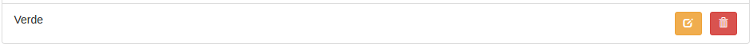

Examen Evaluación Final
=======================

# Día 06/03/2017 Tiempo: 5 horas

* Nota: Cada pregunta se valorará como bien o como mal (valoraciones intermedias serán excepcionales).
* Nota2: En cada pregunta se especifica si se valora en el examen de diseño o en el de desarrollo.
* Nota3: Para aprobar cada examen hay que obtener una puntuación mínima de 5 puntos en ese examen.
* Nota4: Organice su tiempo. Si no consigue resolver un apartado pase al siguiente. Si un apartado depende de otro que no sabe resolver, siempre puede dar una solución que aunque no sea correcta, le permita seguir avanzando.
* Nota5: Para que una solución sea correcta, no sólo hay que conseguir que haga lo que se pide, sino que además todo lo que funcionaba lo tiene que seguir haciendo.
* Nota6: Lea completamente el examen antes de empezar y comience por lo que le parezca más fácil.

Pasos previos antes de empezar

* Clone el repositorio del enunciado

```bash
    git clone https://user-daw-zayas@bitbucket.org/surtich/experts-enunciado-final.git
```

* Vaya al directorio del repositorio

```bash
    cd experts-enunciado-final
```

* Configure su usuario de Git (es único para todos)

```bash
    git config user.name "user-daw-zayas"
    git config user.email "javier.perezarteaga@educa.madrid.org"
```

* Cree un *branch* con su nombre y apellidos separados con guiones (no incluya mayúsculas, acentos o caracteres no alfabéticos, excepción hecha de los guiones). Ejemplo:

```bash
    git checkout -b <fulanito-perez-gomez>
```

* Compruebe que está en la rama correcta:

```bash
    git status
```

* Suba la rama al repositorio remoto:

```bash
    git push origin <nombre-de-la-rama-dado-anteriormente>
```

* Instale las dependencias de cliente y de servidor y arranque cada aplicación (abra un terminal para cada aplicación):

**server:**

```bash
    cd server
    npm install
    npm run db:stop
    npm run db:rm
    npm run db:create
    npm run db:start
    npm start
```

**client:**

```bash
    cd client
    npm install
    npm start
```

Navegue a [http://localhost:3000](http://localhost:3000)

**aplicación de muestra**:

Abra un tercer terminal

```bash
    cd client
    npm run start-prod
```
Navegue a [http://localhost:9000](http://localhost:9000)

* Dígale al profesor que ya ha terminado para que compruebe que todo es correcto y desconecte la red.

## EXAMEN

#### 1.- Modificación de respuestas.

Las respuestas se podrán modificar por los usuarios que las crearon.

Para ello se ha añadido un "endpoint" de modifcación de respuestas ("server/src/question/answer.js"):

Nota: Observe que hay parámetros que se reciben como "path params" y que el texto de la respuesta se recibe como "body param".

```javascript
...
app.put('/api/question/:questionId/answer/:answerId', passport.authenticate('jwt', {session: false}),
asyncRequest(async (req, res) => {
  const {questionId, answerId} = req.params;
  const {answer} = req.body; <-------- el req.body será un string con el nuevo texto de la respuesta
  const user = req.user.id;
  ...
});
...
)
...
```

#### 1.1.- Añada un botón para editar las respuestas



#### 1.1.1.- (1 punto diseño) Se mostrará un botón como el de la imagen (fíjese en tamaño y estilo).
#### 1.1.2.- (1 punto diseño) El botón estará alineado a la derecha (respete la separación respecto al botón de borrar).
#### 1.1.3.- (1 punto diseño) El botón sólo se mostrará cuando el usuario conectado sea el que escribió la respuesta.


#### 1.2.- (1 punto desarrollo) Cree el componente Answer.

El componente Answers ("client/src/components/question/answers.js") recorre con un "map" las respuestas y las pinta en la pantalla.

Es un componente demasiado complejo y más si vamos a implementar la modificación de respuestas. Cree dos componentes:

* Answers ("client/src/components/question/answers.js"): Que recorrerá las respuestas y pintará el nuevo componente Answer para cada respuesta.
* Answer ("client/src/components/question/answer.js"): Será un componete individual que contendrá cada respuesta.

Nota: En los ficheros anteriores no deben quedar rastros de importaciones innecesarias ni variables sin utilizar.

#### 1.3.- Entrada en modo edición.

#### 1.3.1.- Al pulsar sobre el botón de edición se verá lo siguiente:


#### 1.3.1.1.- (1 punto diseño) Se ocultará la vista normal y se mostrará la de edición.
#### 1.3.1.2.- (1 punto diseño) Habrá dos botones: uno para cancelar y otro para aceptar la edición y estarán alineados a la derecha y con los estilos mostrados.
#### 1.3.1.3.- (1 punto diseño) Habrá una caja de texto integrada con los botones que ocupará todo el ancho disponible.
#### 1.3.1.4.- (1 puntos diseño) Al pulsar sobre el botón de cancelar se volverá a la vista normal.
#### 1.3.1.5.- (0,5 puntos desarrollo) La caja de texto contendrá el valor actual de la respuesta.
#### 1.3.1.6.- (0,5 puntos desarrollo) El botón de aceptar la edición estará deshabilitado si la caja de texto está vacía.
#### 1.3.1.7.- (0,5 puntos desarrollo) El botón de aceptar la edición estará deshabilitado si la caja de texto contiene el mismo valor que la respuesta (no hay modificaciones).
#### 1.3.1.8.- (1 punto diseño) Observe que al pulsar sobre editar se produce un efecto molesto de desplazamiento vertical y al finalizar la edición se produce el efecto contrario de contracción. Elimine el efecto de tal forma que no haya ningún desplazamiento al cambiar al modo de edición.

#### 1.4.- Almacenamiento de la moficiación.

#### 1.4.1.- (1 punto diseño) Al pulsar sobre aceptar se mostrará el "Spinner" según se indica en la imagen.


#### 1.4.2.- (1 punto desarrollo) Al pulsar sobre aceptar se llamará al "endpoint" de modificar respuesta con los parámetros adecuados.

#### 1.4.3.- (1 punto desarrollo) Si la modificación se ha podido realizar, se actualizará la respuesta en la vista.

#### 1.4.4.- (1 punto desarrollo) Se mostrará una notificación con la siguiente estructura.


#### 1.4.5.- (1 punto diseño) Al almacenar la respuesta se ocultará el "Spinner" y se volverá a la vista normal.

#### 1.4.6.- (1 punto desarrollo) Se podrán modificar varias respuestas a la vez poniendo el "spinner" en cada una de ellas. El "spinner" se quitará una vez que la respuesta se haya actualizado, permaneciendo los "spinners" de las respuestas restantes que estén pendientes de actualizar.


#### 1.5.- Cancelación de la modificación

#### 1.5.1.- (1,5 puntos desarrollo) Sólo se podrá modificar una respuesta cada vez. Al pulsar sobre el botón de editar, se cancelarán las ediciones que hubiera pendientes.

* Nota: Se cancelarán las ediciones que no se hubieran enviado al servidor (las que estén en modo edición no las que ya se estén actualizando).
* Nota2: Es decir, que sólo puede haber una respuesta editándose cada vez aunque puede haber más de una actualizándose según se indica en el apartado 1.4.6.

#### 1.5.2.- (1 punto desarrollo) También se cancelará la edición en cualquier otra acción:

* Navegar a crear pregunta.
* Borrar una respuesta.
* Crear una respuesta.
* Filtrar preguntas.
* Hacer logout.
* Etc.

#### 1.5.3.- (1 punto desarrollo) Las acciones de creación y eliminación de notificaciones no supondrán cancelar la edición de la respuesta.


Para entregar
-------------

* Ejecute el siguiente comando para comprobar que está en la rama correcta y ver los ficheros que ha cambiado:


```bash
    git status
```

* Prepare los cambios para que se añadan al repositorio local:

```bash
    git add --all
    git commit -m "completed exam"
```

* Compruebe que no tiene más cambios que incluir:

```bash
    git status
```

* Dígale al profesor que va a entregar el examen.

* Conecte la red y ejecute el siguiente comando:

```bash
    git push origin <nombre-de-la-rama>
```

* Abandone el aula en silencio.
